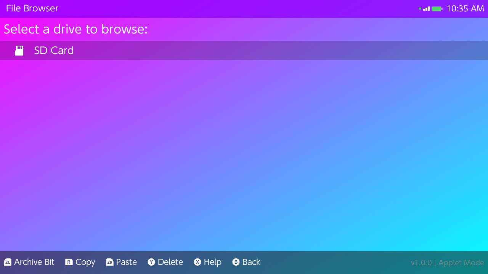
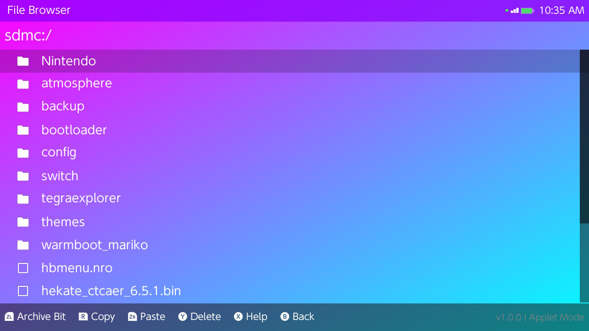
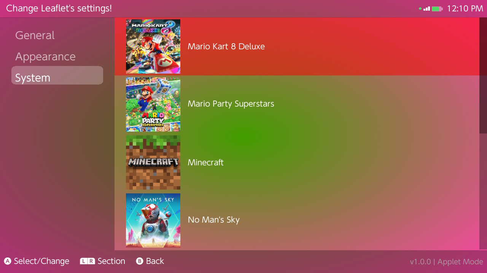
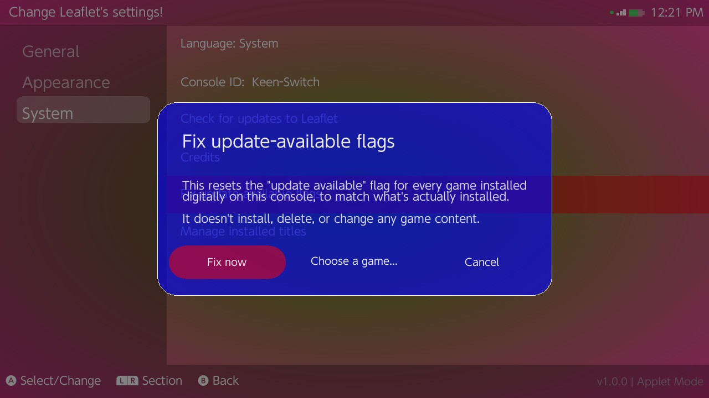

<p align="center">
  
</p>

# Leaflet

Leaflet is a dedicated tool focused exclusively on installing your game dumps onto a Nintendo Switch. Leaflet additionally has a basic file browser, title manager and update prompt "fixer".

## Installing Leaflet

Download the latest release of Leaflet (`leaflet.nro`) from the [releases](https://github.com/DefenderOfHyrule/Leaflet/releases/latest) page and place `leaflet.nro` inside of `sd:/switch`.

## Content installation methods

Leaflet has 5 different methods of installing content, the summary of each method is described in the `Description` column below, with additional information regarding Quark provided later in this readme.

| Methods                             | Description                                                                                        |
|-------------------------------------|----------------------------------------------------------------------------------------------------|
| **SD card**                         | Browse your SD card and install your game dumps.                                                   |
| **USB HDD**                         | Browse an external USB drive (USB stick, SSD, HDD) and install your game dumps.                    | 
| **USB (Quark > Switch)**            | Run Quark on your PC, connect your Switch to your PC via USB and install your game dumps.          |
| **Wireless (LAN) (Quark > Switch)** | Run Quark on your PC, connect your Switch to your PC via LAN and install your game dumps.          |
| **Direct Gamecard installation**    | Install your gamecards directly to your system using the built-in gamecard installer functionality.|

### Installation using Quark

Please refer to the readme of [Quark.NET](https://github.com/DefenderOfHyrule/Quark.NET) for information on how to start using- and install content using Quark.

## Theming

Leaflet also supports fairly extensive theming. It allows you to set RGBA values manually for the several UI components that exist within Leaflet, as well as choose between "preset" themes.

### Preset themes

A small amount of preset themes have been added in Leaflet, these themes have preconfigured color values. To select a preset theme, you can go to `Settings` > `Appearance` > `Select preset theme...`.

The preset themes that are currently in Leaflet are:
- Leaflet ("default"/main Leaflet theme)
- Midnight Blue
- Forest
- Obsidian
- Sakura
- Sunset
- Arctic

If you wish to customize your existing theme, please refer to the [Custom themes](#custom-themes) section below. (This also works with preset themes, you can use them as base for a new custom theme.)

### Custom themes

To configure a custom theme, you can go to `Settings` > `Appearance` > `Custom theme...` and set your desired RGBA color values for the following components:
- Background (not visible when using a gradient)
- Panels (main menu tiles/gamecard info tile)
- Top bar (info bar containing IP address, storage information and time/battery/connetion info)
- Highlight color (selection color on top of main menu tiles)
- Menu highlight color (selection color on menu items in the installation and settings menu's)
- Dialog background color (main color of the dialogue boxes)
- Dialog border color (thin border around dialogue boxes)
- Gradient start & end (background gradient)
- Gradient type (types of gradients, radial or linear)
- Gradient angle (value in between 1 and 359, sets direction of gradient if linear is selected)

If you wish to export your custom theme configuration, this can be done using the [Theme Manager](#theme-manager).

### Theme Manager

The Theme Manager is a dedicated tool/page that allows you to export your custom theme values and share your theme configuration with others!

To export your custom theme, you can go to `Settings` > `Appearance` > `Theme Manager` and press `Y` to export your current theme directly or hover over the `Export custom theme...` menu item and press `A`. 

The exported custom theme will be stored in `sd:/switch/Leaflet/themes`, feel free to share these themes with others!

## File Browser

Leaflet contains a small file browser. This file browser can be used to quickly delete files, copy & paste files, and set the archive bit on folders containing split game dumps. The SD card installation menu also gives you the ability to set the archive bit on folders.

<p align="center">
  
</p>
<p align="center">
  
</p>

- **Note:** Please keep in mind that you cannot undo the act of setting the archive bit from within Leaflet, "reversing" this action requires an external device (PC).


## Title Manager

Leaflet contains a basic title manager which allows you to fully uninstall titles, or remove specific content types (update data/DLC). This title manager can be found in Leaflet in `Settings` > `System` > `Manage installed titles`.

<p align="center">
  
</p>

## Update prompt fixer

Leaflet contains a dedicated tool that allows you to reset the AVM floor of all desired titles installed on your system. This AVM floor reset, simply said, allows you to launch any game on any desired version without running into the "An update is required" popup. This update prompt fixer can be found in `Settings` > `System` > `Fix update-available flags`.

<p align="center">
  
</p>

- **Note:** This tool does *not* allow you to fix the popup where it still allows you to start the software but primarily wants you to download update data. This popup happens when the base game and DLC data is installed but the minimum required update data for said DLC data is missing, "fixing" this popup requires you to either install the minimum required update data for this DLC data or modify the DLC data itself to lower the minimum required version (which is problematic by itself).

---

## Compiling Leaflet

Building Leaflet requires the devkitPro toolchain and the following dependencies:
```sh
sudo (dkp-)pacman -S switch-curl switch-mbedtls switch-sdl2 switch-sdl2_mixer switch-sdl2_gfx switch-sdl2_image switch-freetype switch-libjpeg-turbo switch-libwebp switch-libpng switch-opusfile switch-libmodplug switch-mpg123 switch-libvorbisidec switch-ntfs-3g switch-lwext4
```

Once you've installed these dependencies, clone this repository recursively using the following command:

```sh
git clone --recurse-submodules https://github.com/DefenderOfHyrule/Leaflet
```

Then `cd` into the cloned repository with `cd Leaflet` and run the following command to start compiling Leaflet:

```sh
make -j$(nproc)
```

If you wish to compile a debug release of Leaflet (also useful for providing detailed logs while troubleshooting), run the following command:

```sh
make -j$(nproc) DEBUG=1
```

Output: `leaflet.nro` in the root of the repository.
